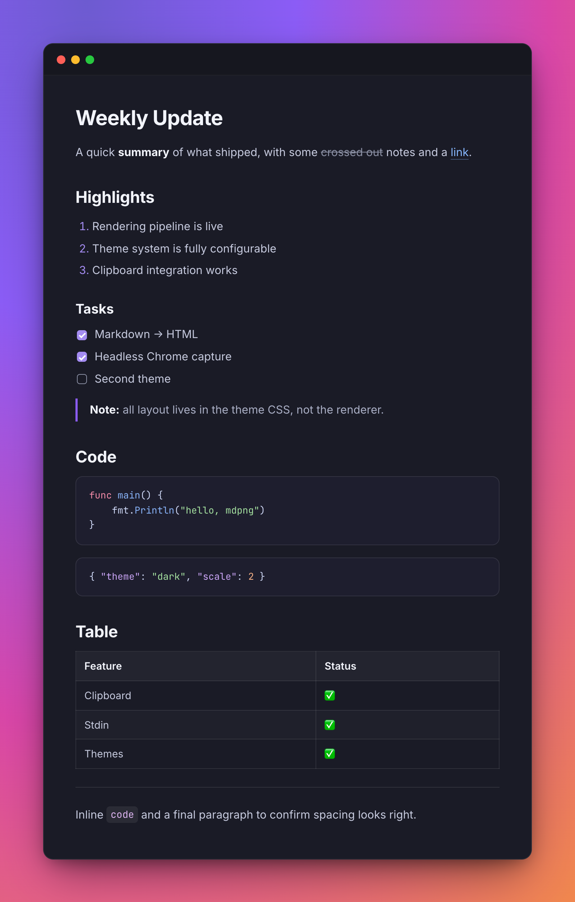

# mdpng

Turn Markdown into a polished, [ray.so](https://ray.so)-style PNG for sharing in Slack and team
chat — straight from the terminal, `pbpaste`-style.

Run it with no arguments and it reads Markdown from your clipboard; or pipe Markdown in. It renders a
window-framed card, saves the image to `~/Downloads`, and copies the PNG back to the clipboard so you
can paste it straight into a message. It can also export a PDF.



## Requirements

- **Go 1.21+** (to install/build)
- **Google Chrome** installed — mdpng drives it headlessly to render
- **macOS** — clipboard integration uses `pbpaste` / `osascript`

## Install

```bash
go install github.com/dcuca/mdpng@latest
```

This builds `mdpng` into your `$GOBIN` (usually `~/go/bin`). Make sure that directory is on your
`PATH`:

```bash
echo 'export PATH="$HOME/go/bin:$PATH"' >> ~/.zshrc && source ~/.zshrc
```

<details>
<summary>Build from source instead</summary>

```bash
git clone https://github.com/dcuca/mdpng.git
cd mdpng
go build -o mdpng .
# optionally: mv mdpng ~/go/bin/   (or another directory on your PATH)
```

</details>

### Updating

```bash
go install github.com/dcuca/mdpng@latest
```

## Usage

```bash
mdpng                                  # render Markdown from the clipboard
cat notes.md | mdpng                   # render Markdown from stdin
echo "# Hello" | mdpng
mdpng -o team-update.png               # choose the output filename
mdpng --pdf                            # export a PDF instead of a PNG
mdpng -o report.pdf                    # a .pdf extension also exports a PDF
mdpng --theme dark                     # choose a theme
cat notes.md | mdpng -o update.png --theme dark
mdpng --list-themes                    # list bundled themes
```

### Flags

| Flag            | Description                                              |
|-----------------|----------------------------------------------------------|
| `-o <file>`     | Output filename (`.png`/`.pdf` added if missing).        |
| `--pdf`         | Export a PDF instead of a PNG.                           |
| `--theme <name>`| Theme to use (default: `dark`).                          |
| `--title <text>`| Optional text shown in the window title bar.             |
| `--list-themes` | List available themes and exit.                          |
| `-h`, `--help`  | Show help.                                               |

Output is saved to **`~/Downloads`** by default. If `-o` is omitted, the file is `md-out1.png`, then
`md-out2.png`, and so on. A bare `-o name.png` also lands in `~/Downloads`; pass a path (`./name.png`
or an absolute path) to write elsewhere.

### PNG vs PDF

By default `mdpng` writes a **PNG** and copies it to the clipboard (ready to paste into Slack). Pass
`--pdf`, or give `-o` a `.pdf` extension, to get a **PDF** instead — a single page sized exactly to
the rendered card, with selectable vector text. The PDF is saved to disk (not copied to the
clipboard). The format is chosen by the `-o` extension when present, otherwise by `--pdf`.

## Supported Markdown

GitHub-flavored Markdown: headings, bold/italic/strikethrough, ordered & unordered lists, task
lists, blockquotes, inline code, fenced code blocks with syntax highlighting, links, tables, and
horizontal rules.

## Themes

Themes are **fully template-driven** — all visual layout (card width, background, padding, radius,
shadow, typography, colors) lives in CSS, not in the Go code. The renderer only measures the result
and clips to it.

A theme is a directory under [`assets/themes/<name>/`](assets/themes):

```
assets/themes/dark/
  theme.json          # manifest: name, display name, chroma syntax style, default window title
  theme.css           # ALL styling, driven by CSS custom properties at :root
  template.html.tmpl  # page structure: background → window chrome → {{.Content}}
  fonts/              # bundled .woff2 fonts (inlined as data: URIs at render time)
```

Bundled themes:

- **`dark`** (default) — a polished, ray.so-inspired dark theme with a vivid gradient background.
- **`brainiac`** — the Brainiac design-system look (dark): Albert Sans, the violet brand with an
  amber "spark" accent, the near-black surface, and the Brainiac wordmark in the title bar.
- **`brainiac-light`** — the light side of the same system: white card on a soft brand-tinted wash,
  dark violet-ink text, light syntax highlighting, and the colored Brainiac wordmark.

To add another theme, copy an existing folder, change the values in `theme.css` / `theme.json`, and
it's immediately available via `--theme <name>` — **no code changes**. Fonts are embedded into the
binary via `go:embed`, so builds stay self-contained.

## How it works

1. Markdown → HTML with [goldmark](https://github.com/yuin/goldmark) (GFM) and
   [chroma](https://github.com/alecthomas/chroma) syntax highlighting.
2. The HTML is injected into the theme's template; fonts are inlined as base64.
3. Headless Chrome ([chromedp](https://github.com/chromedp/chromedp)) renders it — width is
   controlled by the theme, height auto-expands to fit all content. For PNG it screenshots the frame
   at 2×; for PDF it prints a single page sized to the frame (`PrintToPDF`, backgrounds on).
4. The result is saved to `~/Downloads`; a PNG is also copied to the clipboard.

## License

[MIT](LICENSE)
